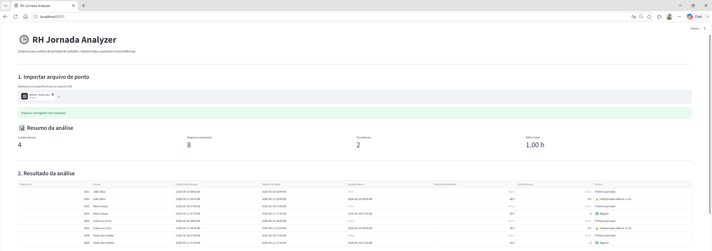
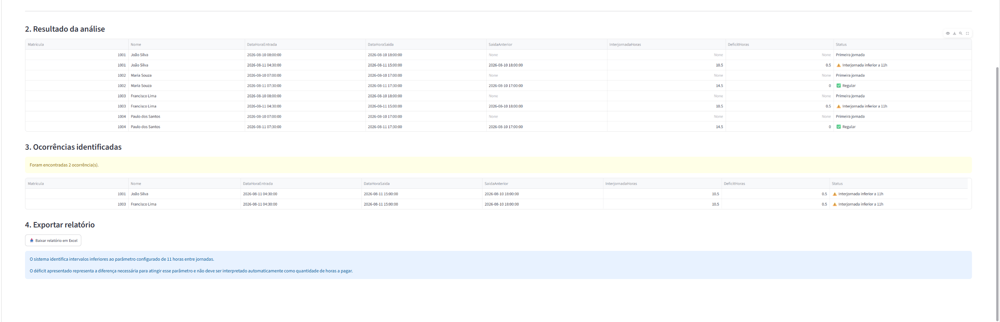

# RH Jornada Analyzer

Aplicação desenvolvida em Python para análise de jornada de trabalho e identificação de possíveis ocorrências de interjornada inferior ao parâmetro de 11 horas.

O projeto foi criado com foco em rotinas de Recursos Humanos e Departamento Pessoal, utilizando tecnologia para automatizar análises que normalmente exigem conferência manual de dados.

## Demonstração

### Visão geral e indicadores



### Ocorrências e exportação


## Funcionalidades

* Importação de arquivos Excel e CSV
* Validação das colunas obrigatórias
* Tratamento de datas e horários
* Identificação de jornadas que ultrapassam a meia-noite
* Organização cronológica dos registros por colaborador
* Cálculo automático do intervalo entre jornadas
* Identificação de ocorrências inferiores a 11 horas
* Cálculo do déficit de descanso
* Dashboard com indicadores
* Visualização completa dos registros analisados
* Exibição separada das ocorrências encontradas
* Exportação dos resultados para Excel
* Geração de arquivo com abas de resultado completo e ocorrências

## Tecnologias utilizadas

* Python
* Streamlit
* Pandas
* OpenPyXL
* Git
* GitHub

## Estrutura esperada da planilha

A aplicação utiliza as seguintes colunas:

* Matrícula
* Nome
* Data
* Entrada
* Saída

Exemplo:

| Matrícula | Nome       | Data       | Entrada | Saída |
| --------- | ---------- | ---------- | ------- | ----- |
| 1001      | João Silva | 10/08/2026 | 08:00   | 18:00 |
| 1001      | João Silva | 11/08/2026 | 04:30   | 15:00 |

## Regra analisada

O projeto utiliza como parâmetro a existência de 11 horas consecutivas de descanso entre duas jornadas de trabalho.

O sistema identifica o intervalo entre a saída da jornada anterior e a entrada da jornada seguinte do mesmo colaborador.

Quando o intervalo encontrado é inferior ao parâmetro configurado, a aplicação classifica o registro como uma ocorrência e calcula o déficit necessário para atingir as 11 horas.

O resultado apresentado possui finalidade de análise e apoio operacional. O déficit identificado não deve ser interpretado automaticamente como quantidade de horas a pagar, devendo qualquer tratamento remuneratório considerar a legislação aplicável, normas coletivas e o caso concreto.

## Como executar o projeto

Clone o repositório:

```bash
git clone URL_DO_REPOSITORIO
```

Entre na pasta:

```bash
cd RH-Jornada-Analyzer
```

Crie um ambiente virtual:

```bash
python -m venv .venv
```

Ative o ambiente virtual no Windows:

```bash
.\.venv\Scripts\Activate.ps1
```

Instale as dependências:

```bash
pip install -r requirements.txt
```

Execute a aplicação:

```bash
python -m streamlit run app.py
```

A aplicação será disponibilizada normalmente em:

```text
http://localhost:8501
```

## Segurança e privacidade

Este projeto deve ser utilizado com dados fictícios ou devidamente anonimizados.

Informações pessoais, folhas de ponto reais, dados de colaboradores ou documentos confidenciais não devem ser publicados no repositório.

## Próximas melhorias

* Filtros por colaborador e período
* Conversão do déficit decimal para horas e minutos
* Exportação de relatório com formatação profissional
* Indicadores por colaborador
* Análise de jornadas superiores ao limite configurado
* Análise de intrajornada
* Alertas de inconsistências
* Configuração dinâmica dos parâmetros de análise
* Melhorias visuais no dashboard
* Testes automatizados

## Sobre o projeto

Projeto desenvolvido como parte do meu portfólio profissional, integrando conhecimentos de Recursos Humanos, Departamento Pessoal, processos trabalhistas e Análise e Desenvolvimento de Sistemas.

O objetivo é demonstrar como programação, análise de dados e automação podem ser aplicadas a problemas reais de RH e Administração de Pessoal.

**Autor:** Jailton Dayvid Silva de Morais
